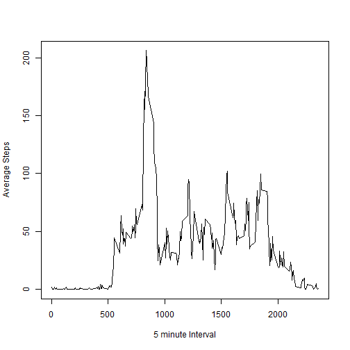
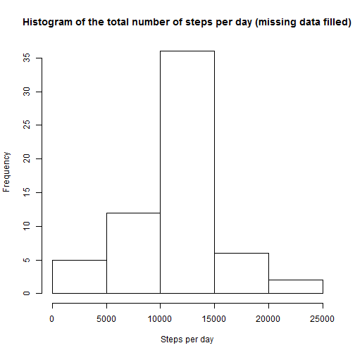

## Loading and preprocessing the data

The data (activity.csv) is contained within activity.zip in the working directory and needs to be unzipped and loaded.


```r
unzip(zipfile = "activity.zip")
activity = read.csv("activity.csv")
```

## What is mean total number of steps taken per day?

Calculate the total number of steps taken per day, ignoring the missing values in the dataset.


```r
# aggregate steps by date
stepsByDate <- aggregate(steps ~ date, data = activity, sum, na.rm = TRUE)

hist(
    stepsByDate$steps, 
    xlab = "Steps per day", 
    main = "Histogram of the total number of steps per day"
    )
```

 

Calculate and report the mean 

```r
mean(stepsByDate$steps)
```

```
## [1] 10766.19
```

and median of the total number of steps taken per day

```r
median(stepsByDate$steps)
```

```
## [1] 10765
```


## What is the average daily activity pattern?

Create a time series plot of the 5-minute interval (x-axis) and the average number of steps taken, averaged across all days (y-axis)

```r
# aggregate steps by interval
stepsByInterval <- aggregate(steps ~ interval, data = activity, mean, na.rm = TRUE)

plot(stepsByInterval$interval, stepsByInterval$steps, type = "l",
     xlab = "5 minute Interval", ylab = "Average Steps")
```

 

On average, across all the days in the dataset, the 5-minute interval that contains the maximum number of steps is:

```r
maxsteps <- stepsByInterval[stepsByInterval$steps==max(stepsByInterval$steps),]
maxsteps
```

```
##     interval    steps
## 104      835 206.1698
```

The maximum average number of steps across all the days is **206.1698113** at interval **835**.

## Imputing missing values

There are a number of days/intervals where there are missing values. The presence of missing days may introduce bias into some calculations or summaries of the data.


```r
# calculate the number of missing days
nomissing <- sum(is.na(activity))
nomissing
```

```
## [1] 2304
```

There are 2304 missing values in the data set.

The missing days will be filled with the mean for that 5 minute interval.  A new dataset will be created with the imputed in values.

```r
## fixsteps fills in the missing step with the average for that interval
## if the steps are not missing, then nothing happens
fixsteps <- function(steps, interval) {
    if(is.na(steps))
    {
        # stepsByInterval holds the mean for each interval
        # value missing so return the average for this interval
        return(stepsByInterval[stepsByInterval$interval==interval,]$steps)
    } else {
        # good
        return(steps)
    }
}

# create the new dataset with the missing values filled
activity_fixed <- activity
activity_fixed$steps <- mapply(FUN = fixsteps, activity$steps, activity$interval)
```

Plot a histogram of the total number of steps taken each day for the new dataset is:

```r
# aggregate the imputed steps data by date
stepsByDate_fixed <- aggregate(steps ~ date, data = activity_fixed, sum)

hist(
    stepsByDate_fixed$steps, 
    xlab = "Steps per day", 
    main = "Histogram of the total number of steps per day (missing data filled)"
    )
```

 

For the total number of steps taken per day in the new dataset, the new mean is: 

```r
mean(stepsByDate_fixed$steps)
```

```
## [1] 10766.19
```

And median is:

```r
median(stepsByDate_fixed$steps)
```

```
## [1] 10766.19
```

These are very similar to the estimates in the first part of the assignment.  The mean has not changed from the first part of the assignment.  However, the median has increased slightly to match the mean.

The impact of imputing missing data on the estimates of the total daily number of steps is small.  The missing values are for whole days rather than random intervals throughout the whole dataset.  As a result the imputed data inserts daily averages, which results in no change to the overall daily average.  However, the imputed data has slightly increased the median.


## Are there differences in activity patterns between weekdays and weekends?

Using the dataset with filled in missing values, create a new factor variable in the dataset with two levels - "weekday" and "weekend" indicating whether a given date is a weekday or weekend day.


```r
# convert to a real date
activity_fixed$date <- as.Date(activity_fixed$date)

# create the new factor variable with weekday or weekend based on the date
activity_fixed$daytype <- factor((weekdays(activity_fixed$date) %in% c('Saturday','Sunday')), 
                                 levels = c(FALSE, TRUE), labels = c('weekday', 'weekend'))
```

Make a panel plot containing a time series plot of the 5-minute interval (x-axis) and the average number of steps taken, averaged across all weekday days or weekend days (y-axis).


```r
library(ggplot2)

# average the steps by interval for plotting
stepsByInterval_fixed <- aggregate(steps ~ interval+daytype, data = activity_fixed, mean)

# plot by the type of day
qplot(
  interval, 
  steps, 
  data = stepsByInterval_fixed,
  col = daytype,
  geom = "line",
  xlab = "Interval", 
  ylab = "Number of steps", 
  main = "Comparison between weekday and weekend steps"
  ) + facet_wrap(~daytype, ncol=1)
```

 

There are differences between average weekday and weekend step count.  Activity on weekdays typically start earlier than weekends and peak about the 800 interval mark.  Activity on weekends generally start a little later and have more consistent steps through the remainder of the day, tailing off in a similar way to weekdays.  This could be indicative of someone getting up earlier to go to work, walking more to get to work and then less during the day, before returning home.
